**[1. Flattening a Linked Lists](https://www.codingninjas.com/studio/problems/1112655)**

**OR**

**[2. Flattening a Linked Lists](https://www.geeksforgeeks.org/problems/flattening-a-linked-list/1)**


##### Problem statement

You are given a linked list containing **_'n'_** **_'head'_** nodes, where every node in the linked list contains two pointers:

(1) **_‘next’_** which points to the next node in the list

(2) **_‘child’_** pointer to a linked list where the current node is the head.

  
Each of these child linked lists is in sorted order and connected by 'child' pointer.


Your task is to flatten this linked such that all nodes appear in a single layer or level in a **_'sorted order'_**__.__

**Example:**

```
Input: Given linked list is:
```


```
Output:
1 → 2 → 3 → 4 → 5 → 6 → 7 → 8 → 9 → 12 → 20 → null.


Explanation:
The returned linked list should be in a sorted order. All the elements in this returned linked list are connected by 'child' pointers and 'next' pointers point to null.
```


**Sample Input 1 :**
```

4
3
1 2 3
3
8 10 15
2
18 22
1
29
```


**Sample Output 1 :**
```
1 2 3 8 10 15 18 22 29
```

  

**Explanation For Sample Input 1:**
```
The given linked list is 
```


```
Therefore after flattening the list will become-
1 -> 2 -> 3 -> 8 -> 10 -> 15 -> 18 -> 22 -> 29 ->null
```

  

**Sample Input 2 :**

```
5
2
4 6
2
5 71
3
7 8 9
3 
11 12 19
3
14 15 17
```

  

**Sample Output 2 :**

```
4 5 6 7 8 9 11 12 14 15 17 19 71
```

  

**Expected Time Complexity:**

```
Try solving this in O(n*n*k), where ‘n’ denotes the number of head nodes and ‘k’ is the average number of child nodes in all 'n' sub-lists.     
```

  

**Expected Space Complexity:**

```
Try solving this without using any extra space.   
```

  

**Constraints:**

```
1 <= n <= 100
1 <= k <= 20
1 <= Node.data <= 10^9

Time Limit: 1 sec
```

***

### Brute Force Approach

### Complexity

- Time complexity: O(x)*2 + (x)log(x)
    
- Space complexity: O(x)*2
    
where
*  x = n*m
* n: Number of Horizontal Nodes and m: Number of Vertical Nodes

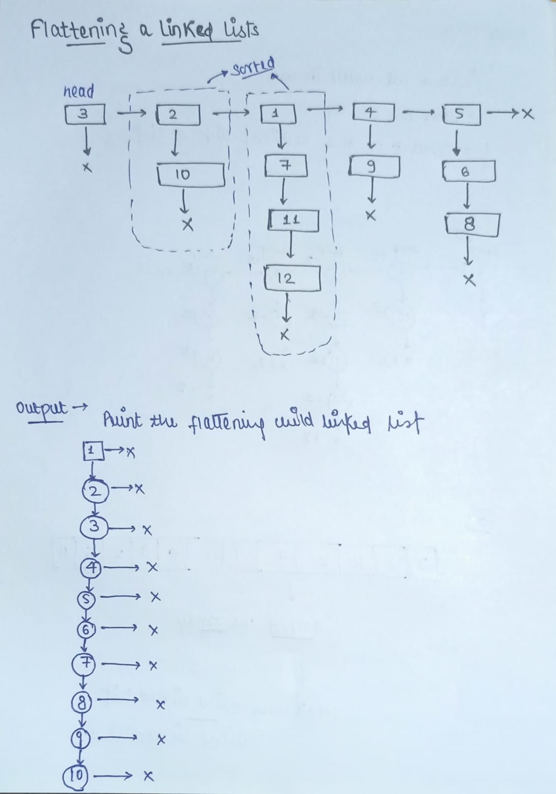

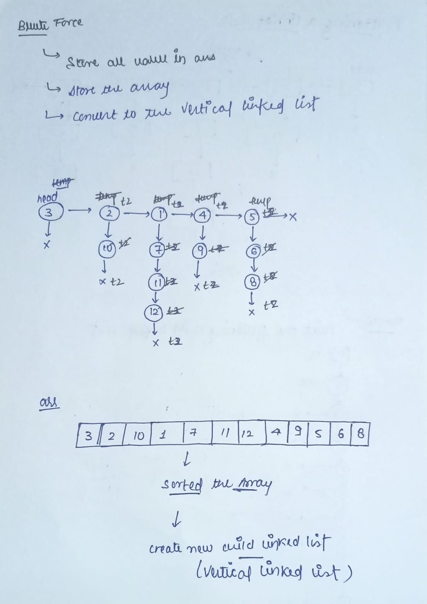

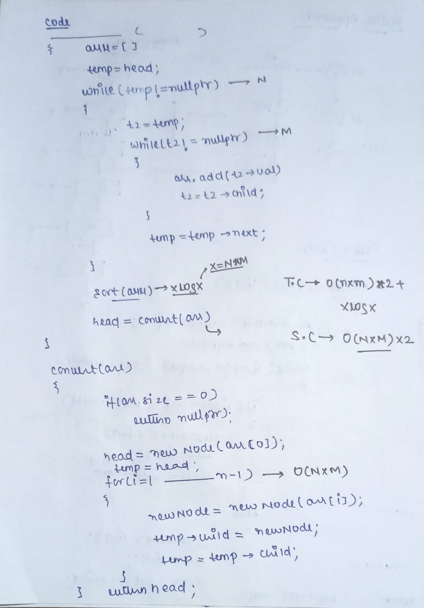


### Code

```cpp
// Brute Force Approach
// Time complexity -> O(x)*2 + (x)log(x) and Space -> O(x)*2
// where x=n*m
// and n: Number of Horizontal Nodes and m: Number of Vertical Nodes
Node *convertVerticalLinkedList(vector<int> &arr)
{
    Node *head = new Node(arr[0]);
    Node *temp = head;
    for(int i=1;i<arr.size();i++)
    {
        Node *newNode=new Node(arr[i]);
        temp->child=newNode;
        temp=temp->child;
    }
    return head; 
}
  
Node* flattenLinkedList(Node* head) 
{
    // Write your code here
    vector<int> arr;
    Node *temp=head;
    while(temp!=nullptr)
    {
        Node *t2=temp;
        while(t2!=nullptr)
        {
            arr.push_back(t2->data);
            t2=t2->child;
        }
        temp=temp->next;
    }
    sort(arr.begin(),arr.end());
    head=convertVerticalLinkedList(arr);
    return head;
}
```

### Optimized Approach

### Complexity

- Time complexity: O(n*m*m)
    
- Space complexity: O(n)
    
where
*  x = n*m
* n: Number of Horizontal Nodes and m: Number of Vertical Nodes

#### Algorithm

Since each list, followed by the bottom pointer, are in sorted order. Our main aim is to make a single list in sorted order of all nodes. So, we can think of a [merge algorithm of merge sort](https://takeuforward.org/data-structure/merge-sort-algorithm/).

The process to flatten the given linked list is as follows:-

- We will recurse until the head pointer moves null. The main motive is to merge each list from the last.
- Merge each list chosen using the merge algorithm. The steps are
- Create a dummy node. Point two pointers, i.e, temp and res on dummy node. res is to keep track of dummy node and temp pointer is to move ahead as we build the flattened list.
- We iterate through the two chosen. Move head from any of the chosen lists ahead whose current pointed node is smaller. 
- Return the new flattened list found.


**Dry Run:**

We will assign individual lists with bottom pointers names as l1, l2, l3, and l4 respectively for our convenience.

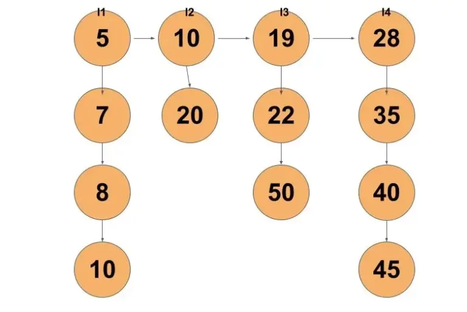


Let’s see the recursion tree of the function flatten and merge function. It will trace down to allow the merge function to merge two sorted lists from the end.

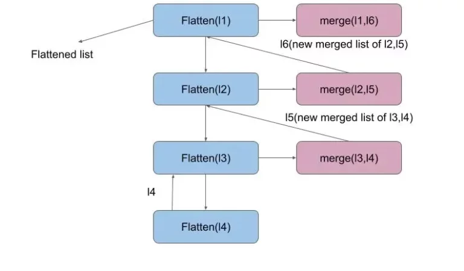


The merge function works like the merge algorithm of merge sort. Firstly, the algorithm will merge l3,l4 lists.

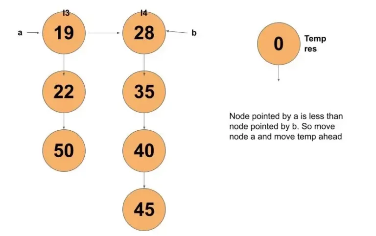


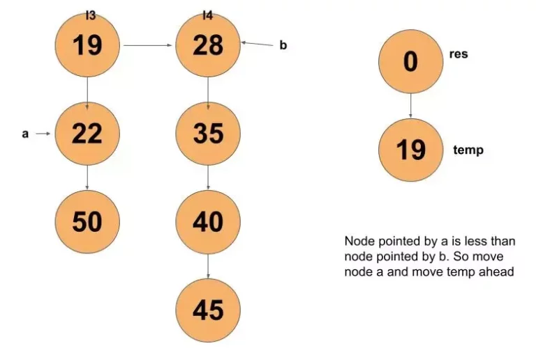

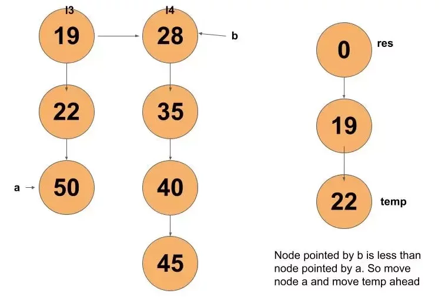


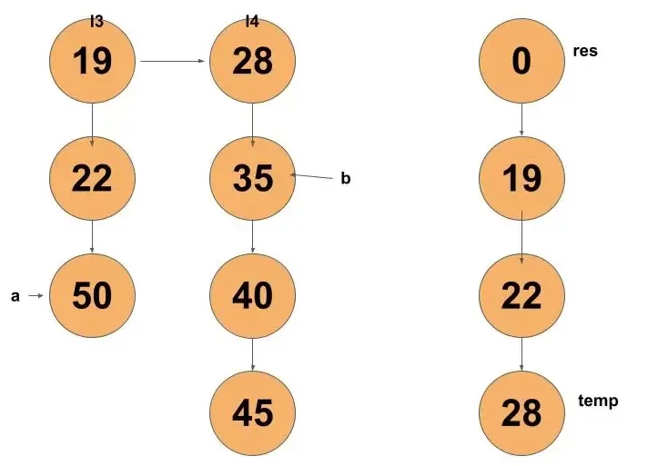


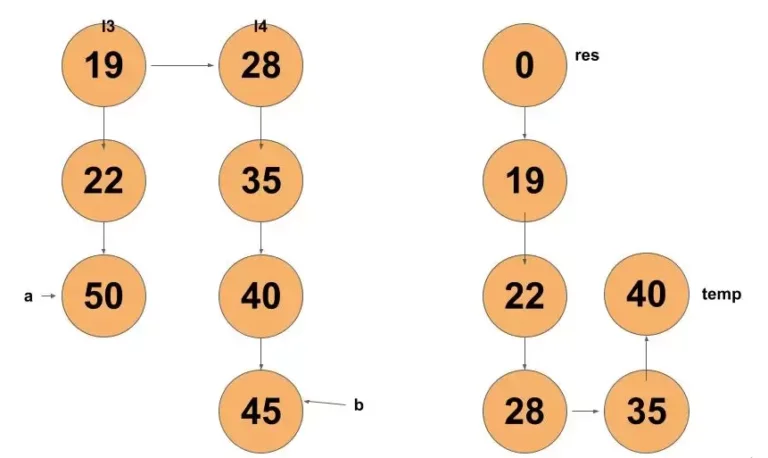

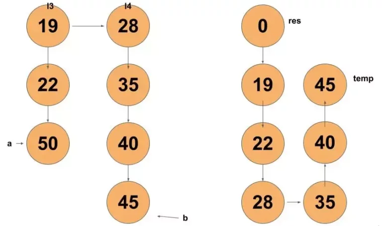


Now, pointer b is null. So, we will merge the remaining nodes of pointer a until node a reaches null.

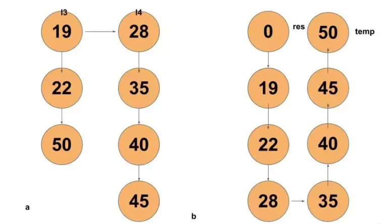


The same way other pairs of lists will be merged.

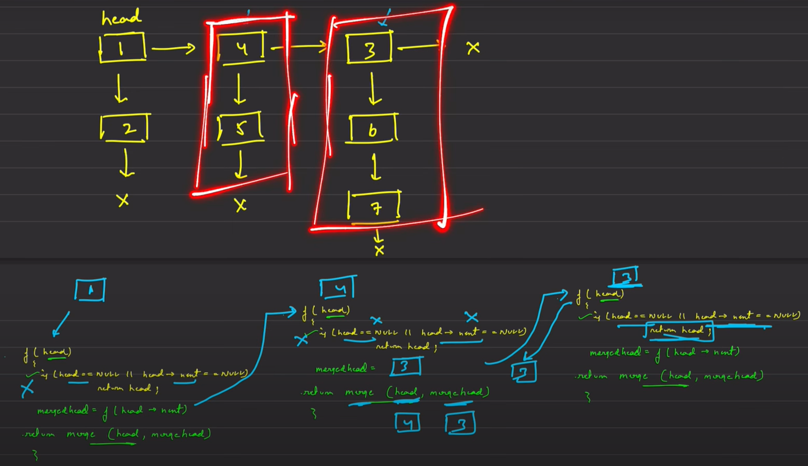

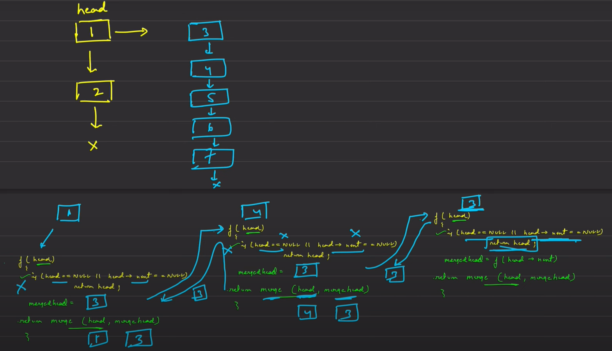

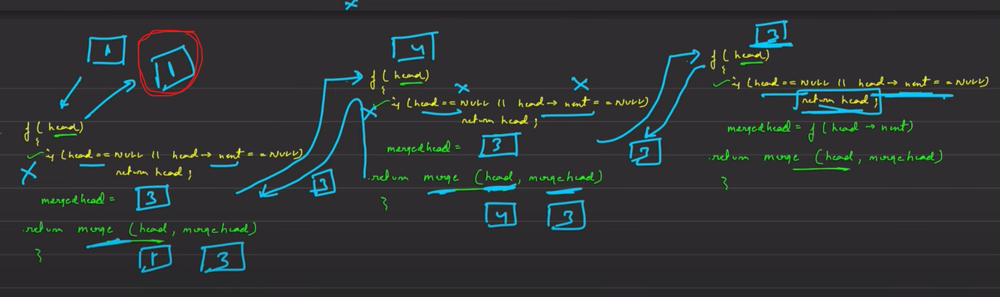


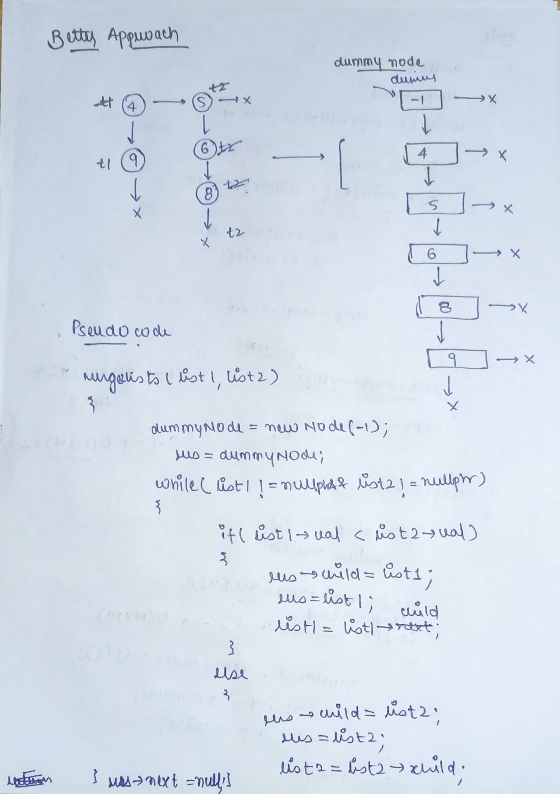

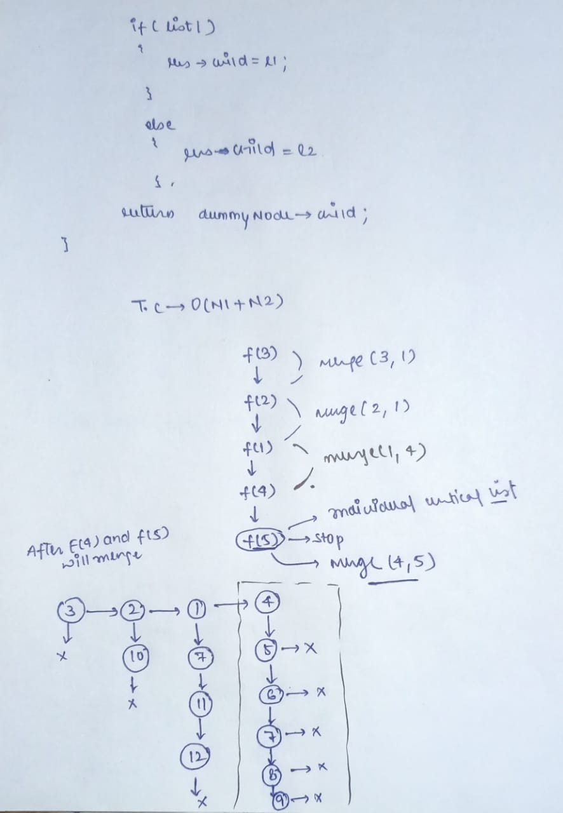

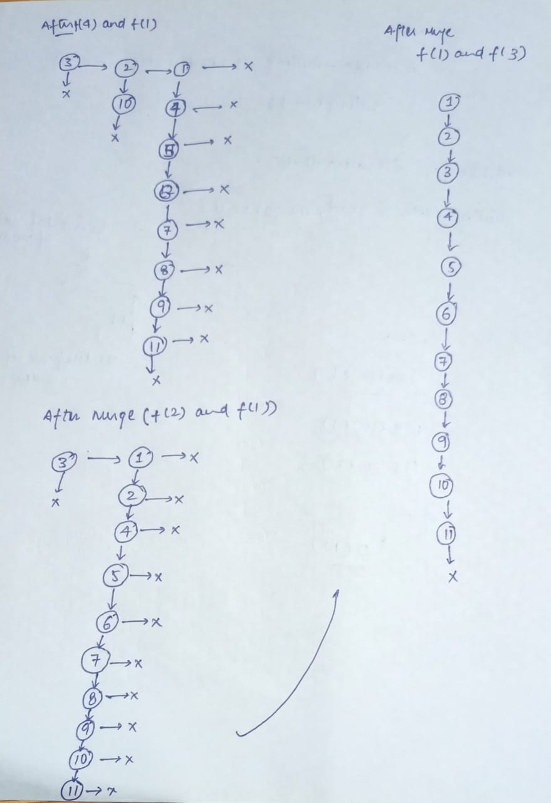

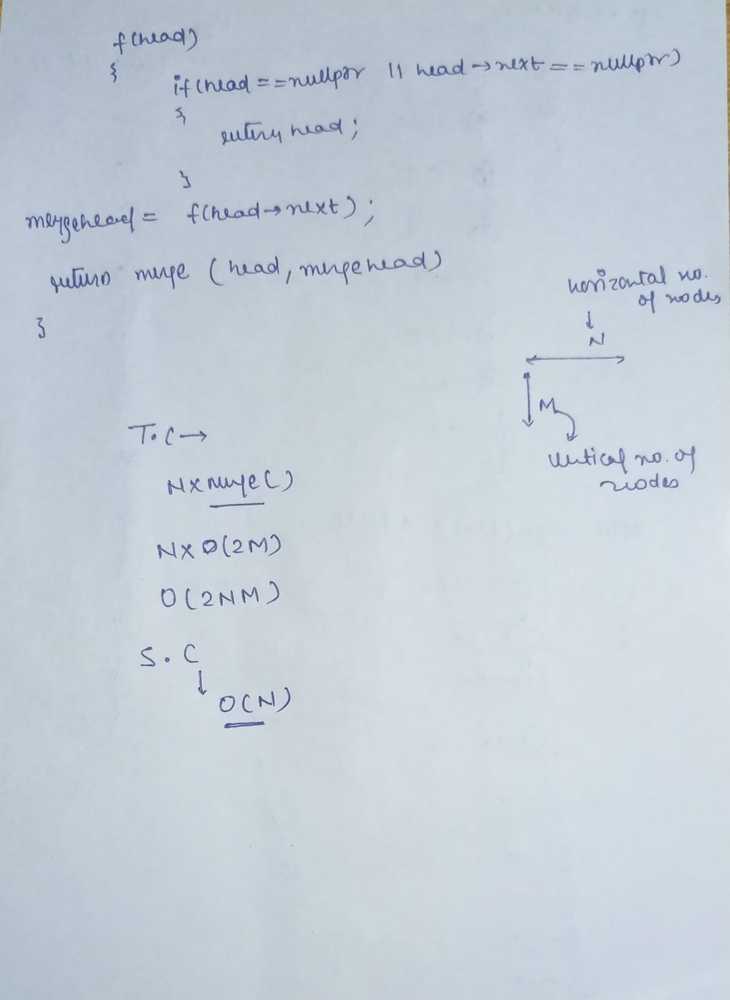

### Code

```cpp
// Optimized Approach
// Time complexity -> O(n*m*m) and Space -> O(n)
// where n: Number of Horizontal Nodes and m: Number of Vertical Nodes

Node *mergeTwoVerticalLinkedLists(Node* list1, Node* list2)
{
    if (list1->data <= list2->data) {
        list2->next = nullptr;
    }
    else{
        list1->next=nullptr;
    }
    Node *dummyNode=new Node(-1);
    Node *res=dummyNode;
    while(list1!=nullptr && list2!=nullptr)
    {
        if(list1->data<list2->data)
        {
            res->child=list1;
            res=list1;
            list1=list1->child;
        }
        else
        {
            res->child=list2;
            res=list2;
            list2=list2->child;
        }
        res->next=nullptr;
    }
    if(list1!=nullptr)
    {
        res->child=list1;
    }
    else
    {
        res->child=list2;
    }
    if(dummyNode->child)
    {
        dummyNode->child->next=nullptr;
    }
    return dummyNode->child;
}

Node* flattenLinkedList(Node* head) 
{
    // Your code here
    if(head==nullptr || head->next==nullptr)
    {
        return head;
    }
    Node *mergeHead=flattenLinkedList(head->next);
    head=mergeTwoVerticalLinkedLists(head,mergeHead);
    return head;
}
```


***

**Important Links**
1.  **[Video Link](https://youtu.be/ykelywHJWLg)**


***

**[For Detailed Solution](https://takeuforward.org/data-structure/flattening-a-linked-list/)**

**Special Thanks to Striver 💙**