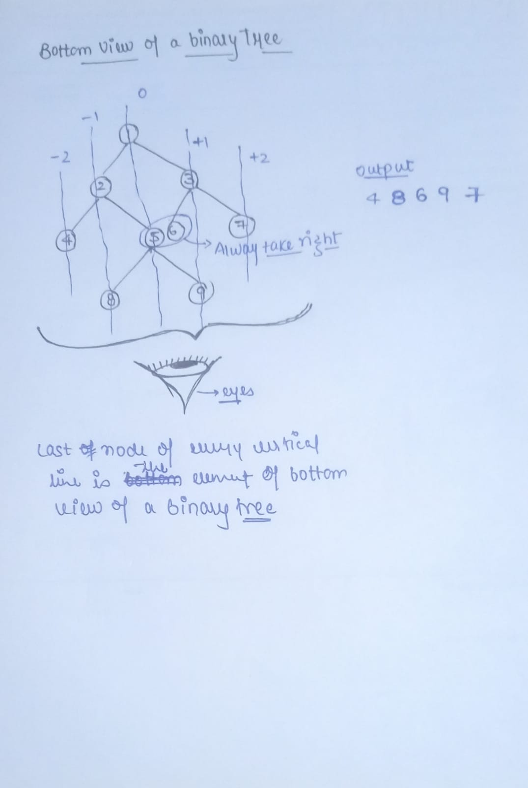
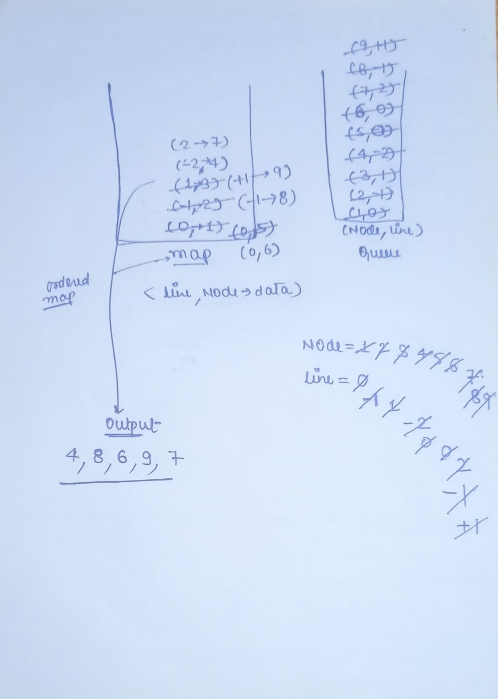

**[Bottom View of Binary Tree](https://www.geeksforgeeks.org/problems/bottom-view-of-binary-tree/1)**

Given a binary tree, print the bottom view from left to right.  

A node is included in bottom view if it can be seen when we look at the tree from bottom.

```
                      20  
                    /    \  
                  8       22  
                /   \        \  
              5      3       25  
                    /   \        
                  10    14
```

For the above tree, the bottom view is `5 10 3 14 25.`  
If there are **multiple** bottom-most nodes for a horizontal distance from root, then print the later one in level traversal. For example, in the below diagram, 3 and 4 are both the bottommost nodes at horizontal distance 0, we need to print 4.

```
                      20  
                    /    \  
                  8       22  
                /   \     /   \  
              5      3 4     25  
                     /    \        
                 10       14
```

For the above tree the output should be `5 10 4 14 25.`  
  
**Note:** The **Input/Output** format and **Example** given are used for the system's internal purpose, and should be used by a user for **Expected Output** only. As it is a function problem, hence a user should not read any input from the stdin/console. The task is to complete the function specified, and not to write the full code.  
 

**Example 1:**

**Input:**      
```
		1
	  /   \
     3     2
```

**Output:** `3 1 2`

**Explanation:**
First case represents a tree with 3 nodes and 2 edges where root is 1, left child of 1 is 3 and right child of 1 is 2.


Thus nodes of the binary tree will be printed as such 3 1 2.


**Example 2:**

**Input:**
```
		10
       /    \
      20    30
     /  \
    40   60
    
```
 
**Output:** `40 20 60 30`


**Your Task:**  
This is a functional problem, you **don't** need to care about input, just complete the function `bottomView()` which takes the root node of the tree as input and returns an array containing the bottom view of the given tree.

**Expected Time Complexity:** O(N*logN).  
**Expected Auxiliary Space:** O(N).

**Constraints:**  
1 <= Number of nodes <= 10<sup>5</sup> 
1 <= Data of a node <= 10<sup>5</sup> 


***

### Optimized Approach

### Complexity

- Time complexity: O(n)
    
- Space complexity: O(n)
    
where n is the number of nodes in the binary tree.


#### Approach: 

- First we have to make a queue of pair which have nodes and their respective `+ve` and `-ve` indexes.
- Then we need a map data structure to store the lines and the nodes. This map will store the data in the form of sorted orders of keys(Lines).
- Here we will follow the level order traversal.
- Traverse through the nodes starting with root,0 and store them to the queue.
- Until the queue is not empty, store the node  and line no. in 2 separate variables .
- Then store the line and the `node->val` to the map, if there will be any node value present that corresponds to a line in the map , it will be replaced by the new node value and by this we will get the last node of each line.
- Store the `node->left` and `node->right` along with their line nos. to the queue.
- Then print the `node->val` from the map

**Tip**: Here there is only 1 small difference from the Top View of the Tree. Here we don’t need to check whether the node is previously present on the map or node before entering it. We have to replace the node of each line if that was previously present on the map.




### Code

```cpp
// Optimized Approach
// Time complexity -> O(n) and Space -> O(n)
// where n: number of nodes in a binary tree

class Solution {
  public:
    vector <int> bottomView(Node *root) {
        // Your Code Here
        vector<int> ans;
        if(root==nullptr)
        {
            return ans;
        }
        map<int,int> mpp;
        queue<pair<Node*,int>> q;
        q.push({root,0});
        
        while(!q.empty())
        {
            auto it=q.front();
            q.pop();
            Node *node=it.first;
            int line=it.second;
            mpp[line]=node->data;
            
            if(node->left!=nullptr)
            {
                q.push({node->left,line-1});
            }
            if(node->right!=nullptr)
            {
                q.push({node->right,line+1});
            }
        }
        for(auto x: mpp)
        {
            ans.push_back(x.second);
        }
        return ans;
    }
};
```


****

**Important Link**
1.  **[Video Link](https://youtu.be/0FtVY6I4pB8)**