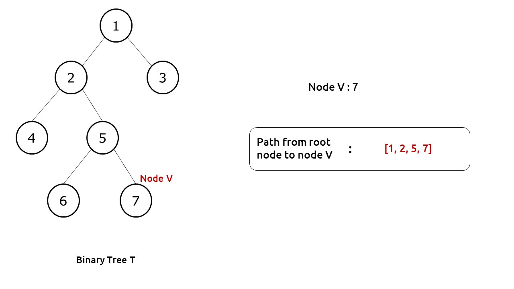
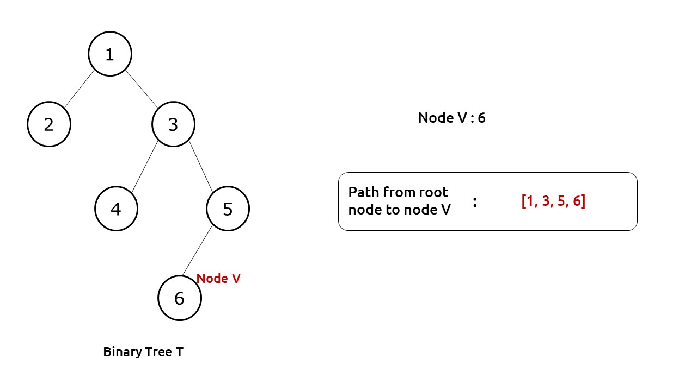
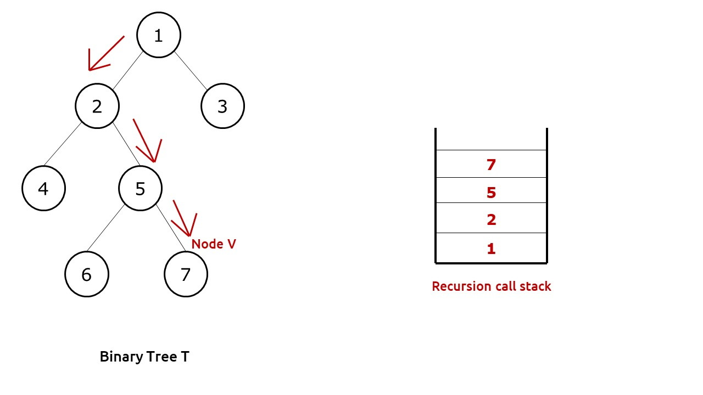

**[Path to Given Node](https://www.interviewbit.com/problems/path-to-given-node/)**


Given a Binary Tree **A** containing **N** nodes.

You need to find the path from **Root** to a given node **B**.


**NOTE:**
- No two nodes in the tree have same data values.
- You can assume that **B** is present in the tree **A** and a path always exists.


**Problem Constraints**  
* 1 <= N <= 105
* 1 <= Data Values of Each Node <= N
* 1 <= B <= N

  
**Input Format**  
* First Argument represents pointer to the root of binary tree **A**.
* Second Argument is an integer **B** denoting the node number.


  
**Output Format**  
Return an one-dimensional array denoting the path from **Root** to the node **B** in order.

    
**Example Input**  

Input 1:

```
 A =  
           1
         /   \
        2     3
       / \   / \
      4   5 6   7 

B = 5
```


Output 1:

```
 [1, 2, 5]
```


Explanation 1:

 We need to find the path from root node to node with data value 5.  So the path is **1 -> 2 -> 5** so we will return [1, 2, 5]


Input 2:

```
 A = 
            1
          /   \
         2     3
        / \ .   \
       4   5 .   6

B = 1  
```


Output 2:

```
 [1]
```


Explanation 2:

 We need to find the path from root node to node with data value 1. As node with data value 1 is the root so there is only one node in the path. So we will return [1]

**Examples**:






***

### Optimized Approach

### Complexity

- Time complexity: O(n)
    
- Space complexity: O(n)
    
where n: number of nodes in a binary tree


**Intuition:** 

First of all, we need to find the node V in our tree for which we need to find the path. We can use any depth-first traversal technique (preorder, inorder, postorder) in order to find the required node.

If we look at the diagram below, we see that whenever we find the required node, its path is well present in our recursion call stack. We just need to figure out how we can use the recursive calls to print the required path.



**Approach:** 

We will use an external list to store our path. This list will be passed by reference to our recursive function. Moreover, we can set the return value of our function as boolean, this will help us to know whether node V was found in a subtree or not.

The algorithm steps can be stated as follows:

- We pass the function with our root node, the path list and node V.
- For the base case, if root is pointing to NULL, we return false as clearly node V can’t be found.
- Now we first push the node to our path list.
- Then we check whether the current node is the target node or not, if it is then no further execution is needed and we return to the parent function.
- If not, then we recursively call its left and right child to find the target node V. If any one of them returns true, it means we have found node V at lower levels and return true from the current function.
- If the value is not found at the current node and neither in any of the recursive calls, it means that the value is not present in the current sub-tree, therefore we pop out the current node from the path list and return false.

### Code

```cpp
/**
 * Definition for binary tree
 * struct TreeNode {
 *     int val;
 *     TreeNode *left;
 *     TreeNode *right;
 *     TreeNode(int x) : val(x), left(NULL), right(NULL) {}
 * };
 */
 
// Optimized Approach
// Time complexity -> O(n) and Space -> O(n)
// Where n: number of nodes in binary tree
bool getPath(TreeNode* root, vector<int> &res, int x){
    // if root is NULL
    // there is no path
    if(root==nullptr){
        return false;
    }
    // push the node's value in 'arr'
    res.push_back(root->val);
    // if it is the required node
    // return true
    if(root->val==x){
        return true;
    }
    // else check whether the required node lies
    // in the left subtree or right subtree of
    // the current node
    if(getPath(root->left,res,x) == true || getPath(root->right,res,x)==true){
        return true;
    }
    // required node does not lie either in the
    // left or right subtree of the current node
    // Thus, remove current node's value from
    // 'res'and then return false  
    res.pop_back();
    return false;
}
vector<int> Solution::solve(TreeNode* A, int B) {
    vector<int> res;
    getPath(A,res,B);
    return res;
}
```


**Important Link**
1. **[Video Link](https://youtu.be/fmflMqVOC7k?si=W3yhhjlcCb0-Jl1H)**
2. **[For Detailed Solution](https://takeuforward.org/data-structure/print-root-to-node-path-in-a-binary-tree/)**


