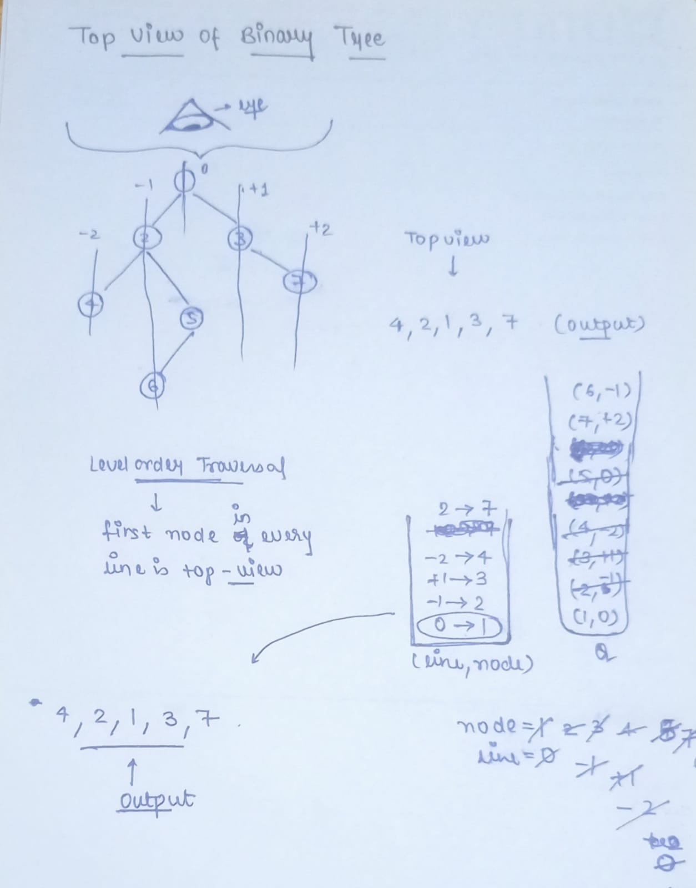

**[Top View of Binary Tree](https://www.geeksforgeeks.org/problems/top-view-of-binary-tree/1)**


Given below is a binary tree. The task is to print the top view of binary tree. Top view of a binary tree is the set of nodes visible when the tree is viewed from the top. For the given below tree

```
       1  
    /     \  
   2       3  
  /  \    /   \  
4    5  6      7
```

Top view will be: `4 2 1 3 7  `
**
Note:** Return nodes from **leftmost** node to **rightmost** node. Also if 2 nodes are outside the shadow of the tree and are at same position then consider the left ones only(i.e. leftmost).   
For ex - `1 2 3 N 4 5 N 6 N 7 N 8 N 9 N N N N N`will give `8 2 1 3` as answer. Here 8 and 9 are on the same position but 9 will get shadowed.


**Example 1:**

**Input:**
```
	      1
	   /    \
	  2      3
```

**Output:** `2 1 3`


**Example 2:**

**Input:**
```
       10
    /      \
  20        30
 /   \    /    \
40   60  90    100
```

**Output:** `40 20 10 30 100`

**Your Task:**  

Since this is a function problem. You don't have to take input. Just complete the function **topView()** that takes **root node** as parameter and returns a list of nodes visible from the top view from left to right.

**Expected Time Complexity:** O(NlogN)  
**Expected Auxiliary Space:** O(N).

**Constraints:**  
1 ≤ N ≤ 10<sup>5</sup>
1 ≤ Node Data ≤ 10<sup>5</sup>


***

### Optimized Approach

### Complexity

- Time complexity: O(n)
    
- Space complexity: O(n)
    
where n is the number of nodes in the binary tree.

#### Approach: 

- First we have to make a queue of pair which have nodes and their respective `+ve` and `-ve` indexes.
- Then we need a map data structure to store the lines and the nodes. This map will store the data in the form of sorted orders of keys(Lines).
- Here we will follow the level order traversal.
- Traverse through the nodes starting with root,0 and store them to the queue.
- Until the queue is not empty, store the node  and line no. in 2 separate variable .
- Then check if that line is present in the map or not
- If not present then store the line and the `node->val` to the map
- Otherwise store the `node->left` and `node->right` along with there line nos. to the queue.
- Then print the `node->val` from the map



### Code

```cpp
// Optimized Approach
// Time complexity -> O(n) and Space -> O(n)
// where n is the number of nodes in the binary tree.
class Solution
{
    public:
    //Function to return a list of nodes visible from the top view 
    //from left to right in Binary Tree.
    vector<int> topView(Node *root)
    {
        //Your code here
        vector<int> ans;
        if(root==nullptr)
        {
            return ans;
        }
        map<int,int> mpp;
        queue<pair<Node*,int>> q;
        q.push({root,0});
        while(!q.empty())
        {
            auto it=q.front();
            q.pop();
            Node *node=it.first;
            int line=it.second;
            
            if(mpp.find(line)==mpp.end())
            {
                mpp[line]=node->data;
            }
            if(node->left!=nullptr)
            {
                q.push({node->left,line-1});
            }
            if(node->right!=nullptr)
            {
                q.push({node->right,line+1});
            }
        }
        for(auto x: mpp)
        {
            ans.push_back(x.second);
        }
        return ans;
    }

};

//{ Driver Code Starts.
int main() {
    int tc;
    cin>>tc;
    cin.ignore(256, '\n');
    while (tc--) {
        string treeString;
        getline(cin, treeString);
        Solution ob;
        Node *root = buildTree(treeString);
        vector<int> vec = ob.topView(root);
        for(int x : vec)
            cout<<x<<" ";
        cout<<endl;
    }
    return 0;
}
// } Driver Code Ends
```


****

**Important Link**
1.  **[Video Link](https://youtu.be/Et9OCDNvJ78)**
